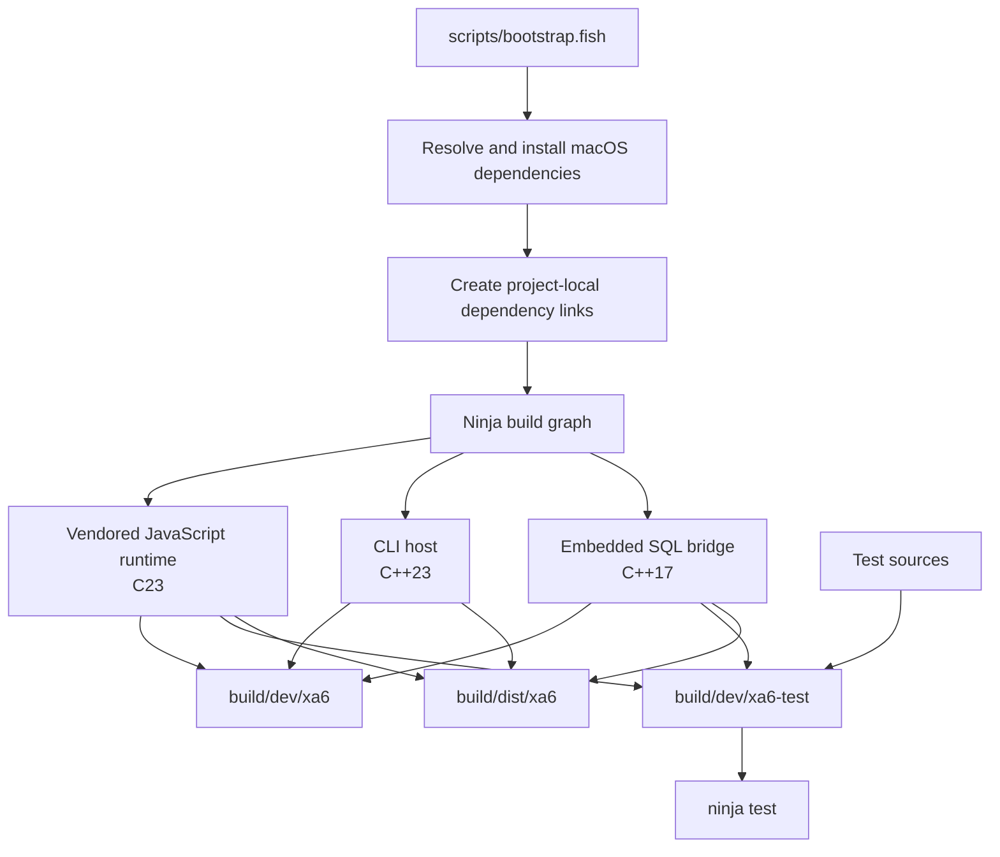
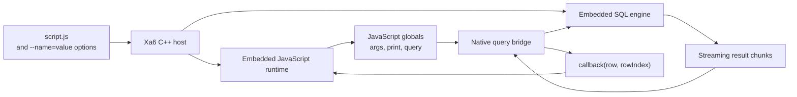

# Xa6

Xa6 (pronounced `/xa-vi lang/`) is a tiny runtime for executing
dashboard-creation scripts. It is designed to integrate with or be embedded in
other tools, including web apps and CLI toolkits.

Each script receives command-line options through `args` and can call the native
`print(...)` and `query(sql, callback)` functions.

Native development is supported on macOS. Linux builds use the container
workflow described below.

## Build on macOS

Run all commands from the repository root.

### Bootstrap and compile

```sh
fish scripts/bootstrap.fish
```

The development executable is:

```text
build/dev/xa6
```

The optimized executable is:

```text
build/dist/xa6
```

## Build targets

After bootstrapping, Ninja can be used directly:

| Command | Result |
|---|---|
| `ninja` | Builds the default executable at `build/dev/xa6` |
| `ninja build/dev/xa6` | Builds only the development executable |
| `ninja test` | Builds and runs the single `build/dev/xa6-test` binary |
| `ninja dist` | Builds the optimized executable at `build/dist/xa6` |
| `ninja compdb` | Generates `compile_commands.json` for editor tooling |
| `ninja -t clean` | Removes outputs registered in the Ninja graph |

`build/dist/xa6` is an optimized local build, not a standalone package. Its
native libraries must remain installed on the machine where it runs.

## Compilation design



## Run Xa6

The command shape is:

```text
xa6 <script.js> [--name=value ...]
```

Running without a script prints this usage information and exits with a failure
status.

Create `demo.js`:

```js
print("mode=", args.mode[0], "\n");

var rowCount = query("SELECT 40 + 2", function (row, rowIndex) {
  print("row ", rowIndex, ": ", row[0], "\n");
});

print("rows=", rowCount, "\n");
```

Run it with one command-line option:

```sh
./build/dev/xa6 demo.js --mode=dev
```

Expected output:

```text
mode=dev
row 0: 42
rows=1
```

Options use the `--name=value` form. Repeated names are collected into arrays
in command-line order:

```sh
./build/dev/xa6 demo.js --mode=dev --mode=trace
```

Inside the script, those values are available as `args.mode[0]` and
`args.mode[1]`.

`print(...)` concatenates its arguments without adding spaces or a newline.
`query(...)` runs synchronously, invokes its callback once per result row as
`callback(row, rowIndex)`, and returns the number of rows processed.

## Runtime design



Results are streamed through the callback rather than accumulated into one
full JavaScript result. This keeps host-side memory bounded to the active result
chunk and row.

Xa6 executes local JavaScript and unrestricted SQL. It is not a security
sandbox; run only scripts you trust.

## Linux container

The Fish bootstrap is intentionally macOS-only. The Dockerfile owns dependency
setup for Linux:

```sh
docker build --tag xa6 .
docker run --rm --volume "$PWD:/work" xa6 demo.js --mode=container
```

The image supports Linux `amd64` and `arm64`. It runs with `/work` as its working
directory, so bind-mounted scripts can be passed by filename.

## Troubleshooting

If compilation reports that `<print>` is unavailable, update the Apple Command
Line Tools and rerun the bootstrap.

If a header or native library cannot be found, rerun:

```sh
fish scripts/bootstrap.fish
```

This recalculates Homebrew prefixes and rebuilds from clean project outputs. For
a normal incremental rebuild after editing source files, use:

```sh
ninja
ninja test
```
